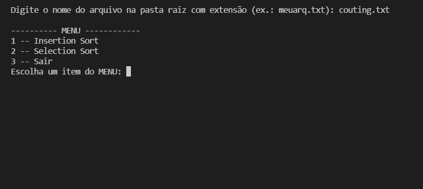
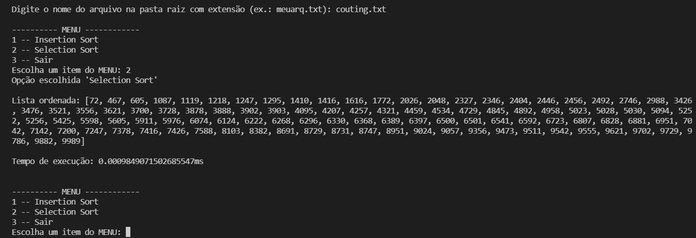

# Ordenação por Comparação 1

Implementação dos seguintes algoritmos de ordenação em Python:

• Selection sort: Wikipedia ([en](https://en.wikipedia.org/wiki/Selection_sort) | [pt](https://pt.wikipedia.org/wiki/Selection_sort)), YouTube ([en](https://www.youtube.com/watch?v=f8hXR_Hvybo)), Khan Academy ([pt](https://pt.khanacademy.org/computing/computer-science/algorithms/sorting-algorithms/a/selection-sort-pseudocode))

• Insertion sort: Wikipedia ([en](https://en.wikipedia.org/wiki/Insertion_sort) | [pt](https://pt.wikipedia.org/wiki/Insertion_sort)), YouTube ([en](https://www.youtube.com/watch?v=DFG-XuyPYUQ)), Khan Academy ([en](https://pt.khanacademy.org/computing/computer-science/algorithms/insertion-sort/a/insertion-sort-pseudocode))
## Screenshots

• Inserindo nome do arquivo com lista a ser ordenada:

• Resultado de um caso de execução:

## Funcionalidades

- Menu de seleção de algoritmo
- Medição de tempo em milissegundo da execução do algoritmo
- Multiplataforma

## Execução

Execução através do terminal na pasta do arquivo inserindo:
python -u "insertion_selection.py"

## Instâncias

A instância principal está no diretório raiz e as demais na pasta "instancias-num". A primeira linha contém a informação da quantidade de números que se seguem, linha por linha, representando a lista desordenada.

## Autor

- [@JGusmao](https://github.com/JGusmao)

