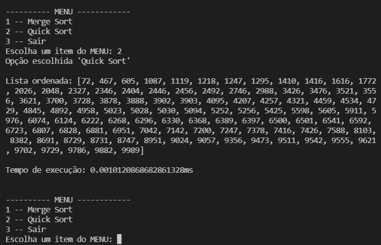

# Ordenação por Comparação 2

Implementação dos seguintes algoritmos de ordenação em Python:

• Merge sort: Wikipedia ([en](https://en.wikipedia.org/wiki/Merge_sort)), YouTube ([pt](https://www.youtube.com/watch?v=5prE6Mz8Vh0)))

• Quick sort: Wikipedia ([pt](https://pt.wikipedia.org/wiki/Quicksort)), YouTube ([pt](https://www.youtube.com/watch?v=wx5juM9bbFo)))

## Screenshots

## Funcionalidades

- Menu de seleção de algoritmo
- Medição de tempo em milisegundos da execução do algoritmo
- Multiplataforma

## Execução

Execução através do terminal na pasta do arquivo inserindo:
python -u "merge_quick.py"

## Instâncias

A instância principal está no diretório raiz e as demais na pasta "instancias-num". A primeira linha contém a informação da quantidade de números que se seguem, linha por linha, representando a lista desordenada.

## Autor

- [@juliogcm](https://github.com/juliogcm)
