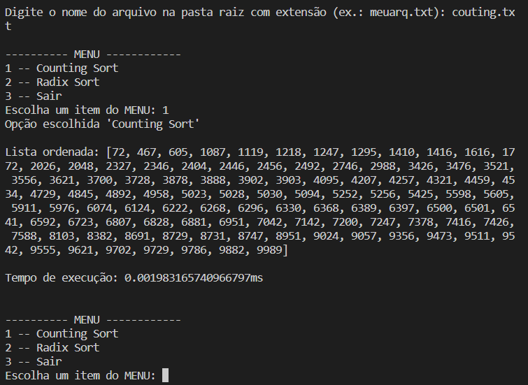

# Ordenação por Comparação 3

Implementação dos seguintes algoritmos de ordenação em Python:

• Counting sort: Wikipedia ([pt](https://pt.wikipedia.org/wiki/Counting_sort)), YouTube ([en](https://www.youtube.com/watch?v=OKd534EWcdk)))

• Radix sort: Wikipedia ([pt](https://pt.wikipedia.org/wiki/Radix_sort)), YouTube ([en](https://www.youtube.com/watch?v=XiuSW_mEn7g)))

## Screenshots

## Funcionalidades

- Menu de seleção de algoritmo
- Medição de tempo em milisegundos da execução do algoritmo
- Multiplataforma

## Execução

Execução através do terminal na pasta do arquivo inserindo:
python -u "insertion_selection.py"

## Instâncias

A instância principal está no diretório raiz e as demais na pasta "instancias-num". A primeira linha contém a informação da quantidade de números que se seguem, linha por linha, representando a lista desordenada.

## Autor

- [@juliogcm](https://github.com/juliogcm)
