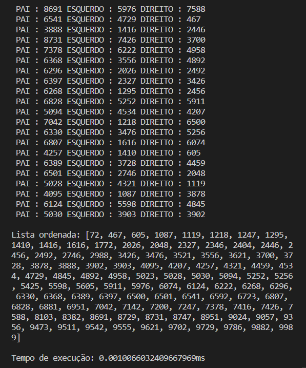

# Ordenação por Comparação 4

Implementação do seguinte algoritmo de ordenação em Python:

• Heap sort: Wikipedia ([pt](https://pt.wikipedia.org/wiki/Heapsort)), YouTube ([pt](https://www.youtube.com/watch?v=bXwCZj1xipY)))

## Screenshots

## Funcionalidades

- Apresentação da Árvore Binária Máxima
- Medição de tempo em milisegundos da execução do algoritmo
- Multiplataforma

## Execução

Execução através do terminal na pasta do arquivo inserindo:
python -u "insertion_selection.py"

## Instâncias

A instância principal está no diretório raiz e as demais na pasta "instancias-num". A primeira linha contém a informação da quantidade de números que se seguem, linha por linha, representando a lista desordenada.

## Autor

- [@juliogcm](https://github.com/juliogcm)
